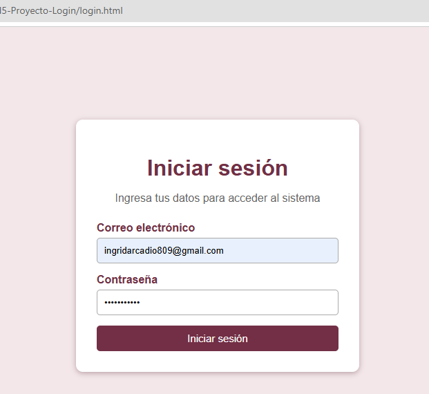
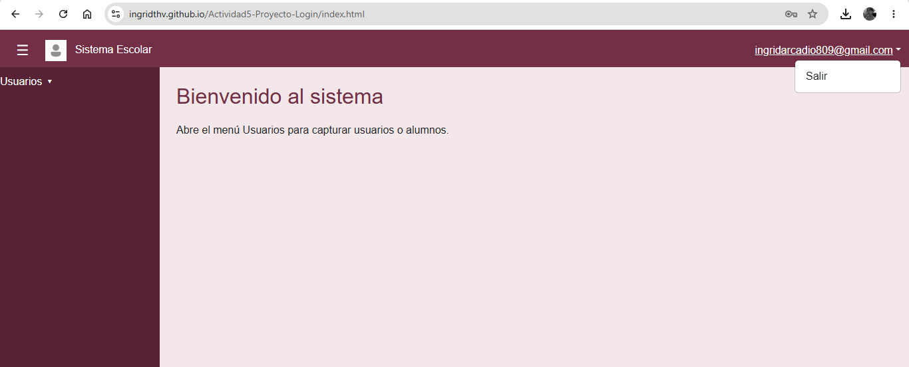
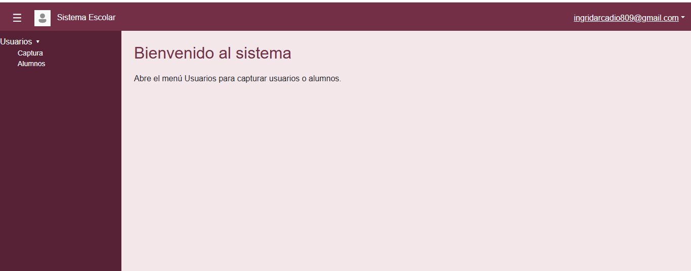
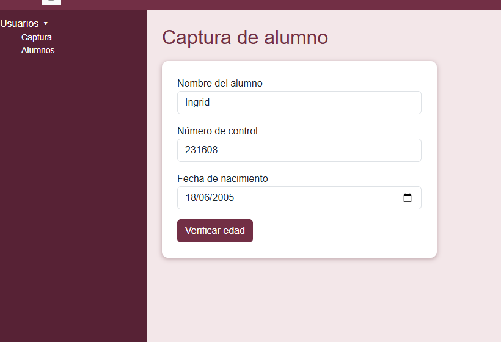
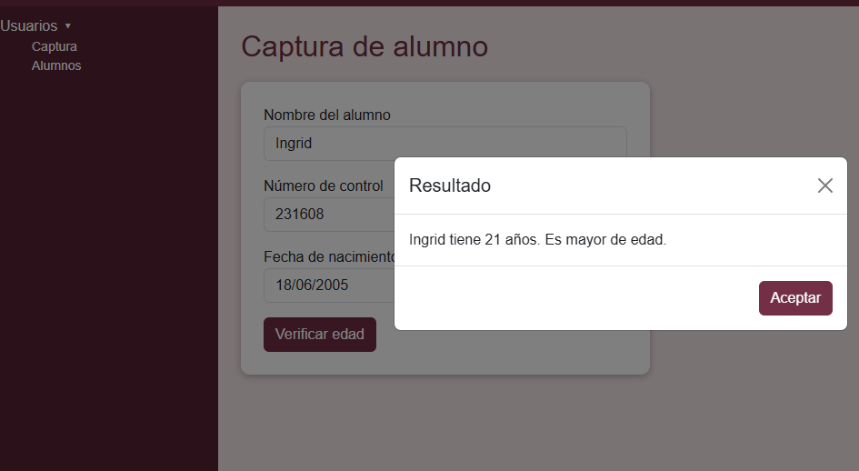

## Actividad 5 PROYECTO LOGIN
### Integrantes del equipo
## Hernández Guzmán Concepción Escarleth
---
## Arcadio Aparicio Ingrid

### Nombre del proyecto
Sistema de Login

---

## Descripción del proyecto

Este proyecto consiste en realizar un sistema de login utilizando HTML, CSS y JavaScript.

El proyecto cuenta con dos pantallas principales. La primera es `login.html`, donde el usuario ingresa su correo y contraseña. Estos datos son validados utilizando las funciones de nuestra librería `utileria.js`.

Si los datos cumplen con las validaciones, el usuario puede ingresar al sistema y es enviado a la página `index.html`.

En `index.html` se encuentra la pantalla principal del sistema, que contiene un navbar, un sidebar y las demás opciones correspondientes al proyecto.

---

## Framework CSS utilizado

Para realizar el diseño del proyecto utilizamos **Bootstrap** como framework CSS.

Bootstrap nos ayudó principalmente a darle estilo y organización a algunos elementos de las páginas, como formularios, botones, navbar y otros componentes.

También utilizamos nuestros propios archivos CSS para personalizar el diseño del proyecto, por ejemplo los colores, tamaños, espacios y algunos estilos del login.

De esta manera utilizamos Bootstrap como base, pero también agregamos nuestros propios estilos.

---

## Funcionamiento del login

El funcionamiento del proyecto comienza en `login.html`.

El usuario debe escribir su correo electrónico y su contraseña. Cuando presiona el botón **Iniciar sesión**, JavaScript obtiene los datos ingresados y realiza las validaciones correspondientes.

Para realizar estas validaciones utilizamos funciones que ya habíamos creado anteriormente en nuestra librería `utileria.js`.

Por ejemplo:

- `validarCorreo()` verifica que el correo tenga un formato correcto.
- `validarPassword()` verifica que la contraseña cumpla con los requisitos establecidos.

Si algún dato no es válido, se muestra un mensaje indicando el error.

Si los datos son correctos, se redirige al usuario hacia `index.html`, simulando que inició sesión correctamente.

El flujo general es:

`login.html` → validación con JavaScript → `index.html`

---

## Paso del nombre de usuario al navbar

Para mostrar el usuario después de iniciar sesión utilizamos `localStorage`.

Cuando el usuario inicia sesión correctamente, guardamos su correo antes de enviarlo a `index.html`.

Ejemplo:

```javascript
localStorage.setItem("nombreUsuario", correo);
window.location.href = "index.html";
```

En `index.html`, el archivo `index.js` lee ese dato con `localStorage.getItem("nombreUsuario")` y lo muestra en el navbar. Si no hay ningún dato guardado, redirige de nuevo a `login.html`.

---

## Pantalla principal (index.html)

`index.html` es la pantalla del sistema ya "dentro". Contiene:

- **Navbar:** barra superior con el logo, el botón hamburguesa y, a la derecha, el correo del usuario. Al dar clic en el correo se despliega un menú con la opción **Salir**, que regresa a `login.html`.
- **Sidebar:** menú lateral que se abre y se cierra con el botón hamburguesa. Tiene la opción **Usuarios** con un submenú desplegable: **Captura** y **Alumnos**.
- **Captura de usuario:** formulario con nombre de usuario, correo y contraseña, validado con `validarCorreo()` y `validarPassword()`.
- **Captura de alumno:** formulario con nombre, número de control (exactamente 6 dígitos) y fecha de nacimiento.
- **Modal de edad:** ventana que muestra la edad del alumno y si es mayor o menor de edad.

---

## Métodos principales

**De `utileria.js`:**

- `validarCorreo()`: revisa que el correo tenga formato válido.
- `validarPassword()`: revisa mínimo 8 caracteres, con mayúscula, minúscula, número y carácter especial.
- `soloLetras()`: acepta solo letras en el nombre del alumno.
- `validarNumeroControl()`: revisa que sean solo números y que sean exactamente 6.
- `calcularEdad()`: calcula la edad a partir de la fecha de nacimiento.
- `esMayorDeEdad()`: indica si la persona tiene 18 años o más.
- `capitalizarTexto()`: pone la primera letra de cada palabra en mayúscula.

**De `login.js`:**

- `iniciarSesion()`: valida el correo y la contraseña, guarda el correo en `localStorage` y redirige a `index.html`.

**De `index.js`:**

- `abrirCerrarMenu()`: muestra u oculta el sidebar.
- `mostrarSeccion()`: cambia entre inicio, captura de usuario y captura de alumno.
- `guardarUsuario()`: valida el formulario de captura de usuario.
- `guardarAlumno()`: valida nombre, número de control y fecha, y abre el modal de edad.
- `salir()`: borra el usuario guardado y regresa a `login.html`.

---

## Proceso de creación

### 1. Login
Creamos `login.html` con el formulario de correo y contraseña, y `login.css` para el diseño. En `login.js` validamos los datos con `validarCorreo()` y `validarPassword()`. Si todo es correcto, se redirige a `index.html`.



### 2. Navbar con el usuario
En `index.html` hicimos la barra superior con Bootstrap. Al entrar, `index.js` lee el correo guardado en `localStorage` y lo muestra a la derecha. Al dar clic aparece el menú con la opción **Salir**.



### 3. Sidebar
Hicimos el menú lateral con el botón hamburguesa, que muestra u oculta el sidebar con la función `abrirCerrarMenu()`. Agregamos la opción **Usuarios** con submenú desplegable (Captura y Alumnos).



### 4. Captura de usuario
Dentro del submenú Captura agregamos el formulario de nombre de usuario, correo y contraseña. Se valida con `validarCorreo()` y `validarPassword()`, y muestra mensajes de error en rojo.
En el formulario de alumnos agregamos el campo de número de control. Se valida con `validarNumeroControl()`, que exige exactamente 6 dígitos.



### 5. Modal de edad
Al enviar el formulario de alumnos con datos válidos, se calcula la edad con `calcularEdad()` y se usa `esMayorDeEdad()` para mostrar en un modal si es mayor o menor de edad.



### 6.Contraseña erronea
![Modal Contraseña incorrecta] (img/contraseña_erronea.png)

### 7.Registro Correo
![Modal registro con correo] (img/registro_correo.png)
---

## Estructura del proyecto

```
login.html
index.html
CSS/   → login.css, index.css
JS/    → utileria.js, login.js, index.js
img/   → logo.png, etc..
```

---

Enlace del proyecto en GitHub Pages:
https://ingridthv.github.io/Actividad5-Proyecto-Login/login.html